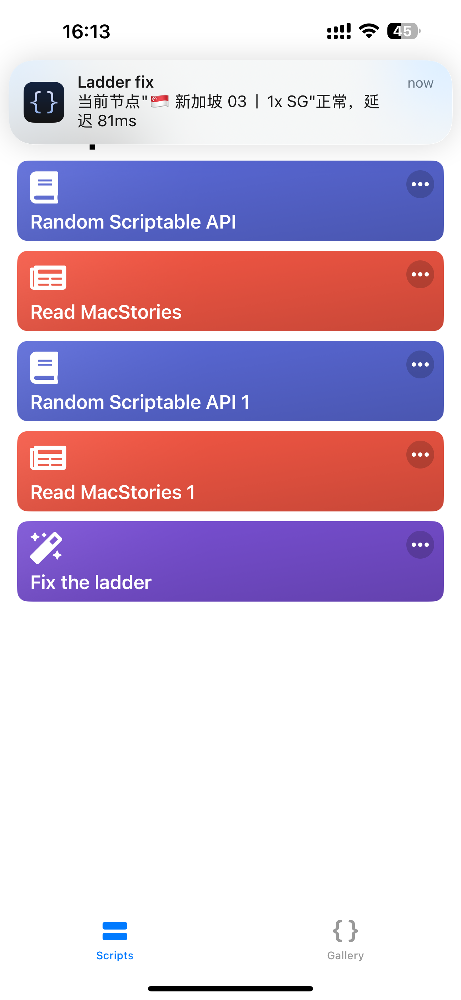

# OpenClash Node Switcher for Scriptable

## Description

This script is designed for iOS devices using the **Scriptable** app to automate node switching in **OpenClash**. It periodically tests the currently active node's delay and automatically switches to the best available node from a predefined list if the current node's connection fails or performs poorly.



**Key Features:**

*   **Automatic Node Testing:** Regularly tests the delay of the currently selected node in a specified OpenClash proxy group.
*   **Fallback to Preferred Nodes:** If the current node fails the delay test, the script automatically switches to the best-performing node from a user-defined list of preferred nodes.
*   **Notifications:** Sends notifications to inform the user about node switching actions and the status of the connection, including:
    *   Successful node switches with the new node's name and delay.
    *   Failure to find a suitable node.
    *   Current node status if it's working correctly.
*   **Customizable:** Allows users to easily configure:
    *   OpenClash controller URL and secret.
    *   Target proxy group name.
    *   Test URL and timeout.
    *   List of preferred nodes.

## Requirements

*   **iOS Device:** An iPhone or iPad.
*   **Scriptable App:** The Scriptable app installed from the App Store.
*   **OpenClash:** OpenClash running on a router or other device within your network.
*   **OpenClash Controller API:** The OpenClash Controller API must be enabled and accessible.
*   **Basic Network Knowledge:** You'll need the IP address or hostname of your OpenClash controller and the secret (if you've configured authentication).

## Installation and Usage

1. **Install Scriptable:** Download and install the Scriptable app from the App Store on your iOS device.
2. **Copy the Script:** Copy the entire JavaScript code from the `script.js` file in this repository.
3. **Create a New Script in Scriptable:**
    *   Open the Scriptable app.
    *   Tap the "+" button in the top-right corner to create a new script.
4. **Paste the Code:** Paste the copied JavaScript code into the Scriptable editor.
5. **Configure Settings:**
    *   **`controllerUrl`:** Replace `'http://192.168.5.1:9090'` with the actual URL of your OpenClash controller.
    *   **`secret`:** Replace `'123456'` with your OpenClash controller secret (if authentication is enabled). If you don't use a secret, leave it as an empty string (`''`).
    *   **`proxyGroupName`:** Change `'♻️ 手动切换'` to the name of the proxy group in OpenClash that you want to manage.
    *   **`testUrl`:** Modify `'http://www.gstatic.com/generate_204'` if you want to use a different URL for testing the connection.
    *   **`timeout`:** Adjust the `1000` (milliseconds) timeout for delay testing as needed.
    *   **`preferredNodes`:** Update the array with the names of your preferred nodes in OpenClash, for example:
        ```javascript
        const preferredNodes = [
          '🇸🇬 新加坡 01丨1x SG',
          '🇭🇰 香港 02丨1x HK',
          '🇺🇸 美国 03丨1x US',
          // ... add your preferred nodes
        ];
        ```
6. **Save the Script:** Tap "Done" to save the script. Give it a descriptive name (e.g., "OpenClash Switcher").
7. **Grant Permissions:** The first time you run the script, Scriptable will likely ask for permissions to:
    *   Access the network.
    *   Send notifications.
    Make sure to grant these permissions.
8. **Run the Script:** Tap on the script's name in the Scriptable main screen to run it.

## Running the Script Automatically (Optional)

Scriptable scripts don't run continuously in the background. To automate the node switching, you have a few options:

**A. Using Shortcuts:**

1. **Create a Personal Automation:**
    *   Open the Shortcuts app.
    *   Go to the "Automation" tab.
    *   Tap the "+" button, then "Create Personal Automation."
2. **Choose a Trigger:** Select a trigger, such as:
    *   **Time of Day:** To run the script at regular intervals.
    *   **App:** To run the script when a specific app is opened or closed (e.g., when you launch a game or streaming app).
    *   **Wi-Fi:** To run the script when you connect to a specific Wi-Fi network.
3. **Add Action:**
    *   Tap "Add Action."
    *   Search for "Scriptable."
    *   Select "Run Script."
    *   Choose your "OpenClash Switcher" script.
    *   Tap "Next" and then "Done."

**B. Using Scriptable's Background Refresh (Limited):**

*   **Periodic Refresh:** Scriptable widgets can refresh periodically in the background, but this refresh is not very frequent and is controlled by iOS. You could add a widget that triggers the script to run, but it won't be as reliable as using Shortcuts.

**C. Using Launch Center Pro:**

*   If you have the Launch Center Pro app, you can use it to schedule more frequent background launches of the Scriptable script via a URL scheme.

## Troubleshooting

*   **"Error getting current node" or "Request failed..."**: Double-check your `controllerUrl`, `secret`, and `proxyGroupName` settings. Make sure your iOS device can reach the OpenClash controller.
*   **No Notifications:** Ensure that Scriptable has permission to send notifications in your iOS device's settings (Settings > Notifications > Scriptable).
*   **Script Not Running Automatically:** Background execution in iOS is complex. Using Shortcuts with appropriate triggers is generally the most reliable way to automate the script.

## Disclaimer

This script is provided as-is, without any warranty. Use it at your own risk. The author is not responsible for any issues caused by the use of this script.
